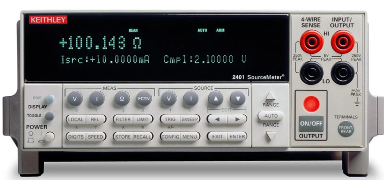

  

 
<h3 align=center>Battery State-of-Charge Measurement Using the Keithley Meter </h2>
<h4 align=center>This repo contains my work on interfacing to the Keithley 2401a sourcementer for battery SOC measurements.</h3>
 

#  Battery SOC Measurement with the Keithley 2401A Sourcemeter.

# Abstract
This repo contains an example of a battery characterization test using the Keithley 2401A 4-wire sourcemeter.

# Background

## Definitions

## Battery Basics

### Discharge Cycle

### Charge Cycle

# Analysis

## Data Pipeline

## ETL

## SOC Generation

## Results
